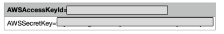

# devops-terraform-aws

For this demo you need to setup the following

* [Install Terraform](https://learn.hashicorp.com/tutorials/terraform/aws-build?in=terraform/aws-get-started)
* [Install AWS CLI](https://docs.aws.amazon.com/cli/latest/userguide/getting-started-install.html)
* [AWS Account](https://aws.amazon.com/free/?all-free-tier.sort-by=item.additionalFields.SortRank&all-free-tier.sort-order=asc&awsf.Free%20Tier%20Types=*all&awsf.Free%20Tier%20Categories=*all)

### **Create Secret and access Key**

1. Go to your aws account on [security_credentials](https://console.aws.amazon.com/iam/home?#/security_credentials)
2. Select **Access Keys**
3. Create New Access Key

You should download a CSV file that contains a AWS AcessKeyId and AWS Secret KeyID

### Setup your credentials

1. Open your CLI and run the following command
2. > aws configure
   >
3. copy and paste the access key and secret key
4. select the default region just press enter

### Basic commands

Initialize terraform

> terraform init

Give format to the files

> terraform fmt

Show the plan to be launched

> terraform plan

Apply changes

> terraform apply

Show the components that has been launched

> terraform state list

Show all the information of the launched configuration, it read the content on the file `terraform.tfstate`

> terraform show

Destroy everythin

> terraform destroy
